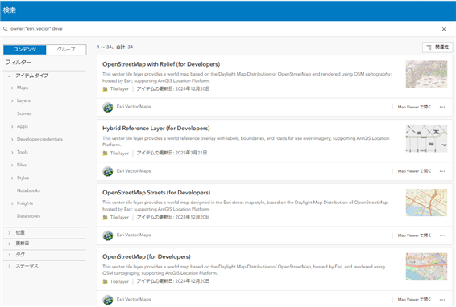
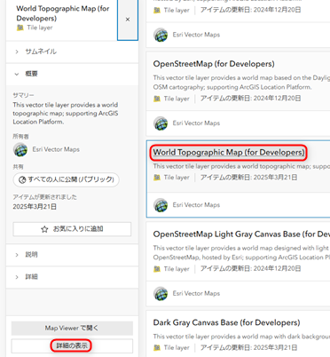
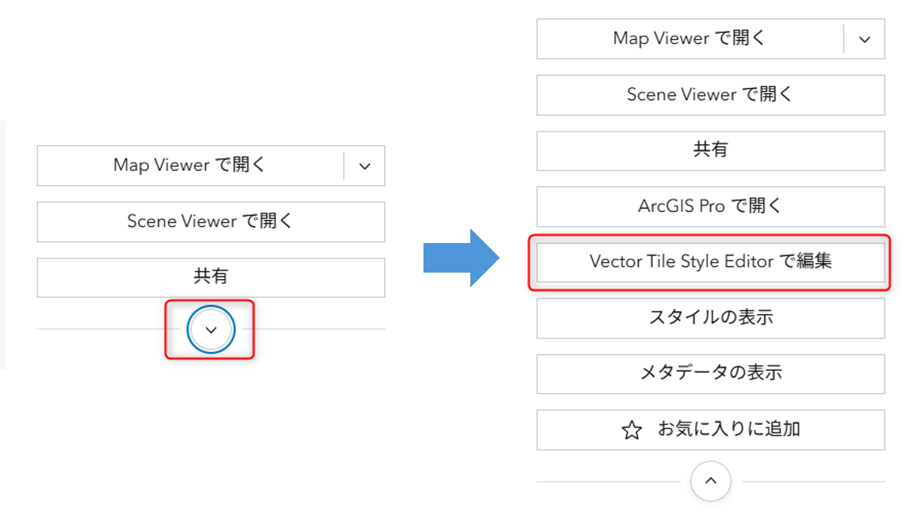
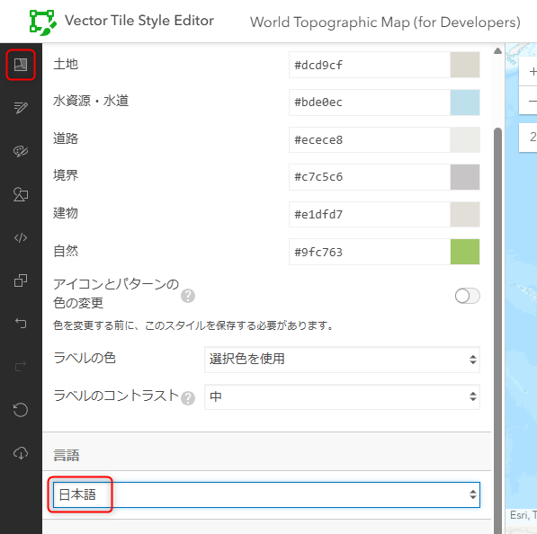
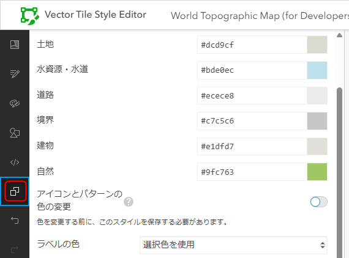
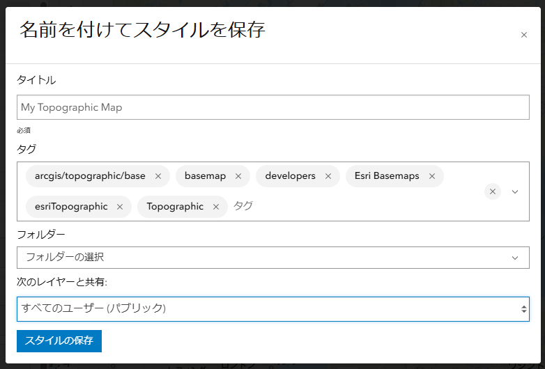
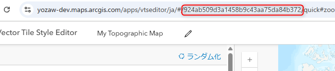

# オフラインマップの表示

「オフラインマップを作成」ボタンをタップすることで、現在表示している範囲のマップをダウンロードして、オフラインで表示します。「オフラインマップを表示」ボタンをタップして、再度オンラインのマップを表示します。

## マップ (ベクター タイル レイヤー) の作成方法

1. [ArcGIS Online](https://www.arcgis.com/home/signin.html) に ArcGIS Online アカウントまたは ArcGIS Location Platform アカウントでサインインします。アカウントをお持ちでない場合は、[こちら](https://esrijapan.github.io/arcgis-dev-resources/guide/get-dev-account/) の手順から無償で作成できます。

2. [こちら](https://www.arcgis.com/home/search.html?restrict=false&sortField=relevance&sortOrder=desc&searchTerm=owner%3A%22esri_vector%22+deve#content) のリンクを開き、ArcGIS Basemap Styles サービス (ベクター タイル レイヤー) のリストを表示します。

    
3. 名前に「(for Developers)」が付いているアイテムの中から、World Street Map (道路地図) や World Topographic Map (地形図) 等の任意のアイテムを選びます。選択したアイテムの名前部分をクリックして、左下に表示される [詳細の表示] をクリックします。

    
4. 右上に表示される [Vector Tile Style Editor で編集] をクリックします。[Vector Tile Style Editor](https://vtse.arcgis.com/documentation/) を使用することで、マップの用途に応じてオリジナルの見た目を設定できます。エディターの詳細については、[こちら](https://community.esri.com/t5/a/v/ta-p/1542347) の記事もご覧ください。

    
5. 左上の [クイック編集] をクリックして、[言語] の設定を英語から日本語に変更します。

    
6. [名前を付けて保存] をクリックして、[名前を付けてスタイルを保存] 画面を表示します。

    
7. タイトルに適当な名前を記入し、[次のレイヤーと共有:] を「すべてのユーザー (パブリック)」に変更して、[スタイルの保存] をクリックします。

    
8. Web ブラウザに表示されている URL の英数字の部分が、このベクター タイル レイヤー スタイルの ID です。ID をコピーします。

    
9. main.dart の 80 行目あたりにある PortalItem.withPortalAndItemId() の itemId にコピーした ID をペーストします。
