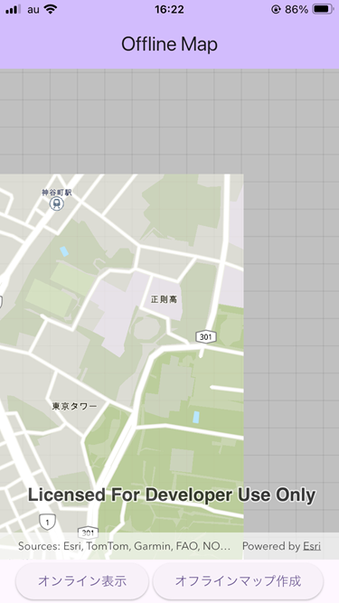

# オフラインマップの表示

「オフラインマップを作成」ボタンをタップすることで、現在表示している範囲のマップをダウンロードして、オフラインで表示します。「オフラインマップを表示」ボタンをタップして、再度オンラインのマップを表示します。

## マップ (ベクター タイル レイヤー) の作成方法

1. [ArcGIS Online](https://www.arcgis.com/home/signin.html) に開発者アカウントでサインインします。

1. [こちら](https://yozaw-dev.maps.arcgis.com/home/search.html?restrict=false&sortField=relevance&sortOrder=desc&searchTerm=owner%3A%22esri_vector%22+deve#content) のリンクを開き、ArcGIS Basemap Styles サービス (ベクター タイル レイヤー) のリストを表示します。

1. 名前に「(for Developers)」が付いているアイテムの中から、World Street Map (道路地図) や World Topographic Map (地形図) 等の任意のアイテムを選びます。選択したアイテムの名前部分をクリックして、左下に表示される [詳細の表示] をクリックします。

1. 右上に表示される [Vector Tile Style Editor で編集] をクリックします。

1. 左上の [クイック編集] をクリックして、[言語] の設定を英語から日本語に変更します。

1. [名前を付けて保存] をクリックして、[名前を付けてスタイルを保存] 画面を表示します。

1. タイトルに適当な名前を記入し、[次のレイヤーと共有:] を「すべてのユーザー (パブリック)」に変更して、[スタイルの保存] をクリックします。

1. Web ブラウザに表示されている URL の英数字の部分が、このベクター タイル レイヤー スタイルの ID です。ID をコピーします。

1. main.dart の 80 行目あたりにある PortalItem.withPortalAndItemId() の itemId にコピーした ID をペーストします。